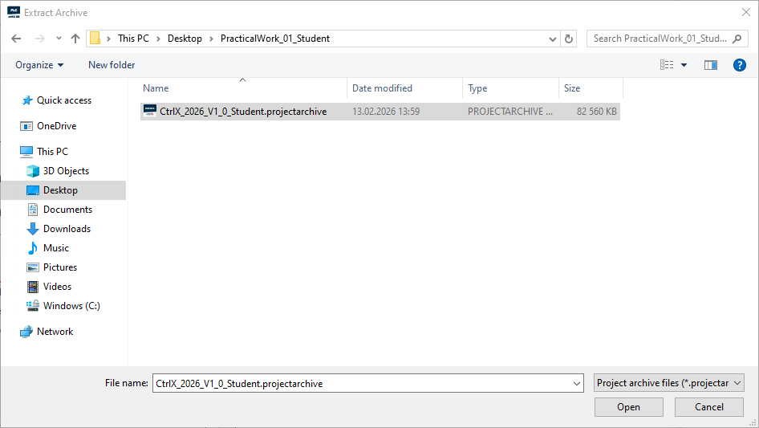
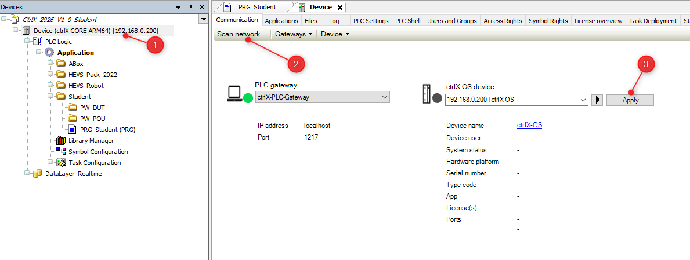
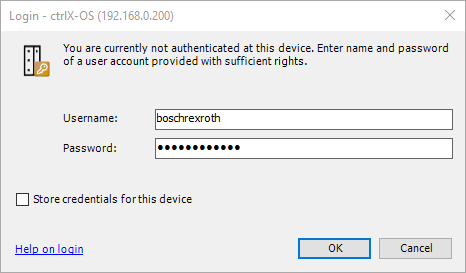
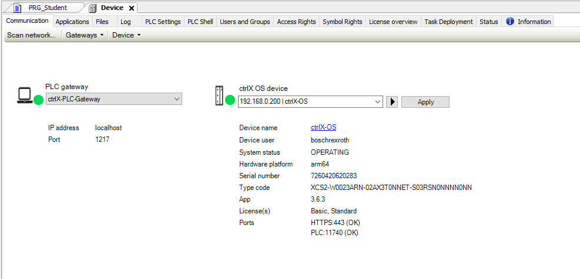
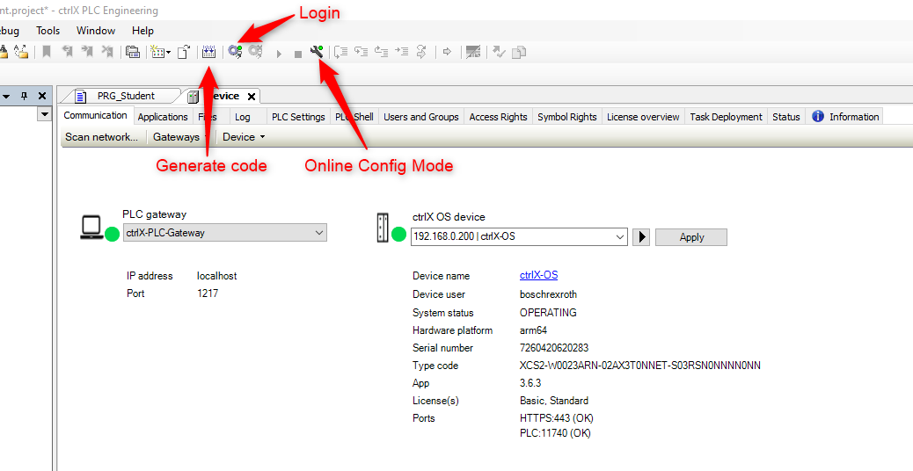
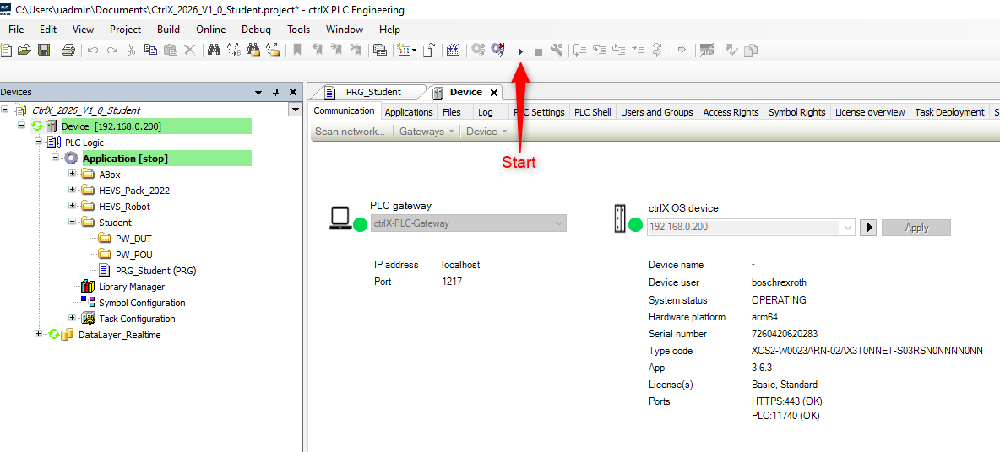
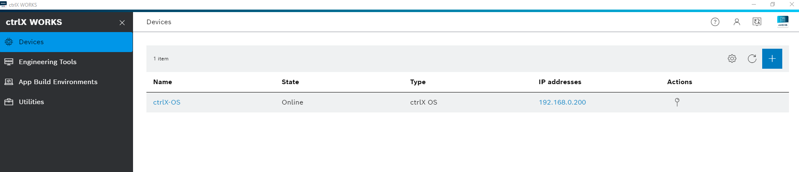
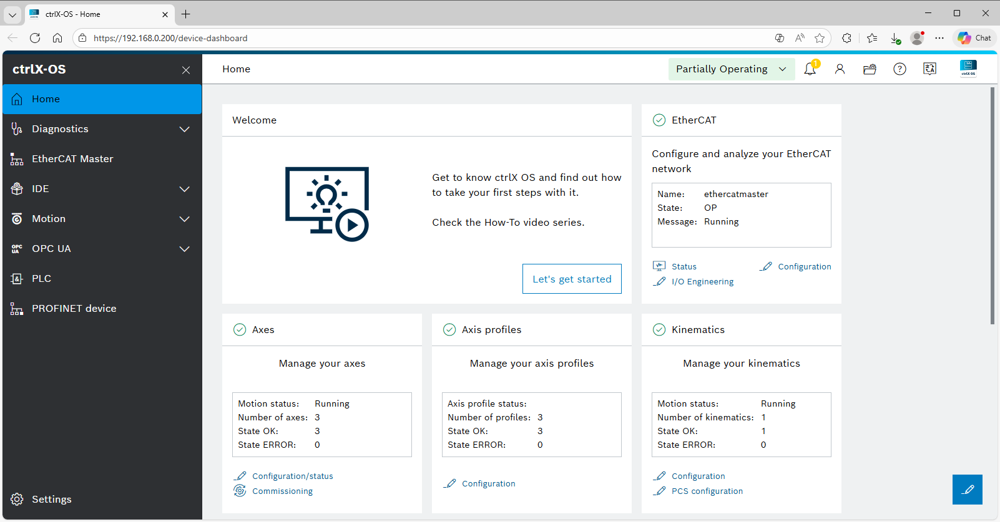
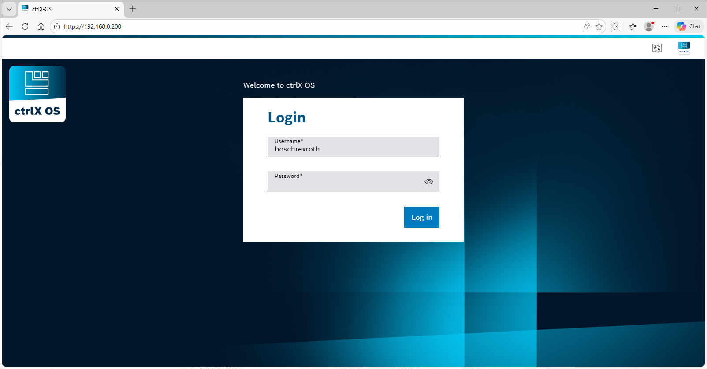

<h1 align="left">
   
  
   
  HEI-Vs Engineering School - Industrial Automation Base
   
</h1>

Cours AutB

# Load archive from folder and download program to CtrlX-Core

Launch program ctrlX PLC Engineering
 

<figure>
    
    <figcaption>ctrlX PLC Engineering.png</figcaption>
</figure>
 

<figure>
    
    <figcaption>AutB Extract From Archive</figcaption>
</figure>

 
<figure>
    
    <figcaption>Select Student version with .projectarchive extension</figcaption>
</figure>

 
**.projectarchive** is to be seen as a *.zip* of all files you need for your project

<figure>
    
    <figcaption>Select where you want your project</figcaption>
</figure>

Scan network to connect IDE with ctrlX Core.

 
Double click on (1) 
Select (2)
Click on (3)

 
<figure>
    
    <figcaption>Scan Network For CtrlX</figcaption>
</figure>

 
Enter username and password to login to ctrlX Core.

Username : boschrexroth
Password : Industrie_21

 
<figure>
    
    <figcaption>Credentials</figcaption>
</figure>

 
 After successfully logging in, the window should look like this.
<figure>
    
    <figcaption>Device User Logon</figcaption>
</figure>

 

# Code generation, login, and program startup

 
<figure>
    
    <figcaption>Generate Code Login</figcaption>
</figure>

 
<figure>
    
    <figcaption>Start Program</figcaption>
</figure>

 

# Access to ctrlX-OS

## By using CtrlX-Works

<figure>
    
    <figcaption>ctrlX-OS by using ctrlX-Works</figcaption>
</figure>

 
Click on "ctrlX-OS" or "IP Address" (192.168.0.200)

username: **boschrexroth**
password: **Industrie_21**

 
When you are connected you have access to the ctrlX-OS.

<figure>
    
    <figcaption>CtrlX-OS</figcaption>
</figure>

 

## By using a Browser

<figure>
    
    <figcaption>CtrlX-OS by using a browser</figcaption>
</figure>

username: **boschrexroth**
password: **Industrie_21**

When you are connected you have access to the ctrlX-OS.

